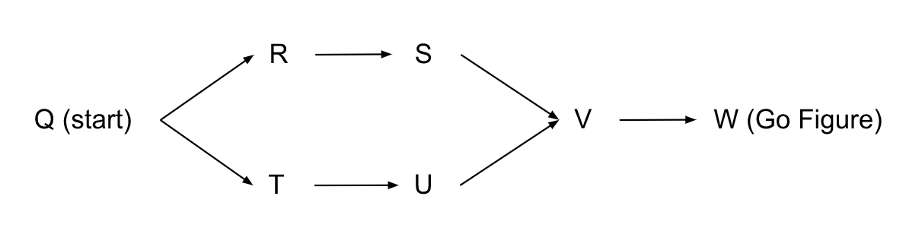

# 6.1 WebSocket Shuttle

## Problem Statement

Go Figure has organized a shuttle service for employees coming to the office. Along a particular route, there are fixed pick-up points. Go Figure is introducing a system where employees can share their pick-up points and also retrieve real-time updates about the location of the shuttle.

You have been given the task of implementing a function that can be used on the client side to establish a WebSocket connection and send and receive messages.

Depending on the number of riders at each pick-up point, the shuttle will take one of two alternative routes for part of the ride.



The route may be `Q -> R -> S -> V -> W` or `Q -> T -> U -> V -> W`.

After the connection is established, the employee should notify their desired pick-up location. Whenever an employee shares a pick-up location, there will be a message from the shuttle service notifying the shuttle's next location.

The following is expected from the client.

- If the shuttle has already gone past the desired pick-up location, the client should close the connection.
- If the shuttle has not yet passed the desired pick-up location, and the location is on the route taken by the shuttle, the connection needs to be kept open until the employee is picked up. The shuttle service will close the connection once the employee is picked up.
- If the shuttle has not gone past the pick-up location but is on the route that does not contain the desired pick-up location, the employee will try to join the shuttle at the junction `V`. The client should then send a message to the service with the new pick-up location ("V") after which the shuttle service will inform the currently valid next location. Step 1 or 2 above has to then be followed based on the new desired pick-up location ("V") and the shuttle's next location.

## Constraints

- No pick-ups happen at the start point (`Q`) and the end point (`W`).
- There are `5` possible pick-up locations (`R`, `S`, `T`, `U`, and `V`).
- When establishing the connection, a query parameter named `name` should be specified with the name of the employee.
- Specify a `timeout` of `2` seconds when calling `close()` on clients. E.g., where `cl` is the name of the client, `cl->close(timeout = 2)`

## Definition 

Define a function named `negotiatePickUp` that accepts a connection URL (`string url`), the name of the employee (`string name`), and the desired pick-up location (`Location location`), where `Location` is an `enum` with the valid pick-up locations (`"R"`, `"S"`, `"T"`, `"U"`, and `"V"`) **and** the end location (`"W"`). The function should establish the connection and communicate as in the problem statement. The argument for `url` will be in the form `"ws://localhost:9094/shuttle"`.

The return type should be `[Location, Location]|error` where

- A `[Location, Location]` value is returned if there is a valid pick-up point. The first member of the tuple should be the **finalized pick-up point**. The second member should be the **finally notified next location** of the shuttle. Note: the finalized pick-up point may not be the same as the argument due to the presence of two different routes. Similarly, there may be more than one notification from the shuttle service due to updated pick-up requests, and therefore what needs to be returned is the next location that was notified at last, when agreeing on the pick-up point.
- An `error` value is returned if
  - client initialization fails or
  - sending a message fails or
  - receiving a message fails or
  - calling `close()` on the client fails or
  - the shuttle has already gone past the pick-up point

```ballerina
function negotiatePickUp(string url, string name, Location location) returns [Location, Location]|error {

}
```

## Example 1

A valid pick-up point exists

- Connection URL - `ws://localhost:9094/shuttle?name=mary`
- Message sent to the server - `"U"`
- Message received from the server - `"T"`
- Function returns `["U","T"]`

## Example 2

The shuttle has gone past the desired pick-up point

- Connection URL - `ws://localhost:9094/shuttle?name=jo`
- Message sent to the server - `"R"`
- Message received from the server - `"S"`
- Client should close the connection.

## Test Environment

This solution requires the shuttle service to be up and running.

An implementation of a simple shuttle service is provided in the `shuttle_service` module. 

Running `bal test` will handle starting up the service, and the tests will be run passing the relevant URL as the first argument to `negotiatePickUp`.

## Hints

- [WebSocket client API documentation](https://lib.ballerina.io/ballerina/websocket/2.2.1/clients/Client)
- [Simple WebSocket client handling text messages](https://ballerina.io/learn/by-example/websocket-client)
- When a tuple value `[Location, Location]` is returned, the second member (next location of the shuttle) should be either a point before the first member or the same as the first member (desired pick-up point).
- [Enums](https://ballerina.io/learn/by-example/enumerations)
